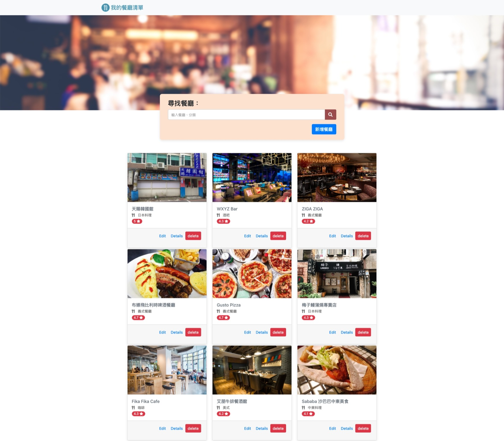

# My Restaurant List 2.0 / 我的餐廳清單 2.0

This is the version 2.0 for "My restaurant list" project.

## Intro

The website for the restaurant list. You can browse restaurants list, view detailed information include the rating, all restaurants data are from AlphaCamp's API. 

## User Story

- User can view all restaurants include details.
- User can find all restaurants' address via Google Maps.
- User can search for a specific restaurant via keyword or category.
- User can add new restaurant.
- User can edit restaurants.
- User can delete restaurants.

## How to Start the project

1. Make sure you have node.js and npm installed first.
2. Clone the project to your localhost.
3. Go to the folder through the terminal and type:

   ```bash
   npm install
   ```

4. After installation, continue typing:

   ```bash
   npm run start
   ```

5. If you see this line, it means it is running smoothly, open your browser and go to the following URL:

   ```bash
   Listening on http://localhost:3000
   ```

6. If you want to stop it:

   ```bash
   ctrl + c
   ```

## Development tools

- Node.js 14.16.0
- Express 4.17.1
- Express-Handlebars 5.3.5
- Bootstrap 4.3.1
- Font-awesome 5.8.1
- MongoDB
- mongoose 6.4.2

## Screenshot

